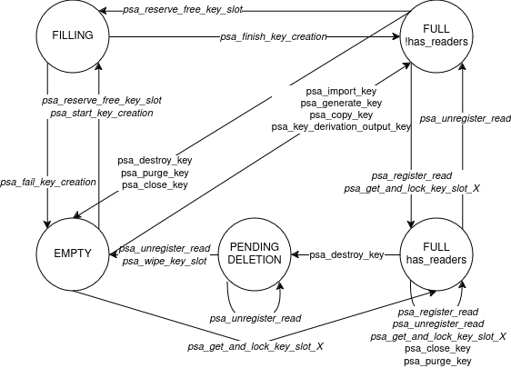

# Thread safety of the PSA subsystem

Currently PSA Crypto API calls in Mbed TLS releases are not thread-safe. In Mbed TLS 3.6 we are planning to add a minimal support for thread-safety of the PSA Crypto API (see section [Strategy for 3.6](#strategy-for-36)).

In the [Design analysis](#design-analysis) section we analyse design choices. This discussion is not constrained to what is planned for 3.6 and considers future developments. It also leaves some questions open and discusses options that have been (or probably will be) rejected.

## Design analysis

This section explores possible designs and does not reflect what is currently implemented.

### Requirements

#### Backward compatibility requirement

Code that is currently working must keep working. There can be an exception for code that uses features that are advertised as experimental; for example, it would be annoying but ok to add extra requirements for drivers.

(In this section, “currently” means Mbed TLS releases without proper concurrency management: 3.0.0, 3.1.0, and any other subsequent 3.x version.)

In particular, if you either protect all PSA calls with a mutex, or only ever call PSA functions from a single thread, your application currently works and must keep working. If your application currently builds and works with `MBEDTLS_PSA_CRYPTO_C` and `MBEDTLS_THREADING_C` enabled, it must keep building and working.

As a consequence, we must not add a new platform requirement beyond mutexes for the base case. It would be ok to add new platform requirements if they're only needed for PSA drivers, or if they're only performance improvements.

Tempting platform requirements that we cannot add to the default `MBEDTLS_THREADING_C` include:

* Releasing a mutex from a different thread than the one that acquired it. This isn't even guaranteed to work with pthreads.
* New primitives such as semaphores or condition variables.

#### Correctness out of the box

If you build with `MBEDTLS_PSA_CRYPTO_C` and `MBEDTLS_THREADING_C`, the code must be functionally correct: no race conditions, deadlocks or livelocks.

The [PSA Crypto API specification](https://armmbed.github.io/mbed-crypto/html/overview/conventions.html#concurrent-calls) defines minimum expectations for concurrent calls. They must work as if they had been executed one at a time (excluding resource-management errors), except that the following cases have undefined behavior:

* Destroying a key while it's in use.
* Concurrent calls using the same operation object. (An operation object may not be used by more than one thread at a time. But it can move from one thread to another between calls.)
* Overlap of an output buffer with an input or output of a concurrent call.
* Modification of an input buffer during a call.

Note that while the specification does not define the behavior in such cases, Mbed TLS can be used as a crypto service. It's acceptable if an application can mess itself up, but it is not acceptable if an application can mess up the crypto service. As a consequence, destroying a key while it's in use may violate the security property that all key material is erased as soon as `psa_destroy_key` returns, but it may not cause data corruption or read-after-free inside the key store.

#### No spinning

The code must not spin on a potentially non-blocking task. For example, this is proscribed:
```
lock(m);
while (!its_my_turn) {
    unlock(m);
    lock(m);
}
```

Rationale: this can cause battery drain, and can even be a livelock (spinning forever), e.g. if the thread that might unblock this one has a lower priority.

#### Driver requirements

At the time of writing, the driver interface specification does not consider multithreaded environments.

We need to define clear policies so that driver implementers know what to expect. Here are two possible policies at two ends of the spectrum; what is desirable is probably somewhere in between.

* **Policy 1:** Driver entry points may be called concurrently from multiple threads, even if they're using the same key, and even including destroying a key while an operation is in progress on it.
* **Policy 2:** At most one driver entry point is active at any given time.

Combining the two we arrive at **Policy 3**:

* By default, each driver only has at most one entry point active at any given time. In other words, each driver has its own exclusive lock.
* Drivers have an optional `"thread_safe"` boolean property. If true, it allows concurrent calls to this driver.
* Even with a thread-safe driver, the core never starts the destruction of a key while there are operations in progress on it, and never performs concurrent calls on the same multipart operation.

#### Long-term performance requirements

In the short term, correctness is the important thing. We can start with a global lock.

In the medium to long term, performing a slow or blocking operation (for example, a driver call, or an RSA decryption) should not block other threads, even if they're calling the same driver or using the same key object.

We may want to go directly to a more sophisticated approach because when a system works with a global lock, it's typically hard to get rid of it to get more fine-grained concurrency.

#### Key destruction short-term requirements

##### Summary of guarantees in the short term

When `psa_destroy_key` returns:

1. The key identifier doesn't exist. Rationale: this is a functional requirement for persistent keys: the caller can immediately create a new key with the same identifier.
2. The resources from the key have been freed. Rationale: in a low-resource condition, this may be necessary for the caller to re-create a similar key, which should be possible.
3. The call must not block indefinitely, and in particular cannot wait for an event that is triggered by application code such as calling an abort function. Rationale: this may not strictly be a functional requirement, but it is an expectation `psa_destroy_key` does not block forever due to another thread, which could potentially be another process on a multi-process system. In particular, it is only acceptable for `psa_destroy_key` to block, when waiting for another thread to complete a PSA Cryptography API call that it had already started.

When `psa_destroy_key` is called on a key that is in use, guarantee 2. might be violated. (This is consistent with the requirement [“Correctness out of the box”](#correctness-out-of-the-box), as destroying a key while it's in use is undefined behavior.)

#### Key destruction long-term requirements

The [PSA Crypto API specification](https://armmbed.github.io/mbed-crypto/html/api/keys/management.html#key-destruction) mandates that implementations make a best effort to ensure that the key material cannot be recovered. In the long term, it would be good to guarantee that `psa_destroy_key` wipes all copies of the key material.

##### Summary of guarantees in the long term

When `psa_destroy_key` returns:

1. The key identifier doesn't exist. Rationale: this is a functional requirement for persistent keys: the caller can immediately create a new key with the same identifier.
2. The resources from the key have been freed. Rationale: in a low-resource condition, this may be necessary for the caller to re-create a similar key, which should be possible.
3. The call must not block indefinitely, and in particular cannot wait for an event that is triggered by application code such as calling an abort function. Rationale: this may not strictly be a functional requirement, but it is an expectation `psa_destroy_key` does not block forever due to another thread, which could potentially be another process on a multi-process system. In particular, it is only acceptable for `psa_destroy_key` to block, when waiting for another thread to complete a PSA Cryptography API call that it had already started.
4. No copy of the key material exists. Rationale: this is a security requirement. We do not have this requirement yet, but we need to document this as a security weakness, and we would like to satisfy this security requirement in the future.

As opposed to the short term requirements, all the above guarantees hold even if `psa_destroy_key` is called on a key that is in use.

### Resources to protect

Analysis of the behavior of the PSA key store as of Mbed TLS 9202ba37b19d3ea25c8451fd8597fce69eaa6867.

#### Global variables

* `psa_crypto_slot_management::global_data.key_slots[i]`: see [“Key slots”](#key-slots).

* `psa_crypto_slot_management::global_data.key_slots_initialized`:
    * `psa_initialize_key_slots`: modification.
    * `psa_wipe_all_key_slots`: modification.
    * `psa_get_empty_key_slot`: read.
    * `psa_get_and_lock_key_slot`: read.

* `psa_crypto::global_data.rng`: depends on the RNG implementation. See [“Random generator”](#random-generator).
    * `psa_generate_random`: query.
    * `mbedtls_psa_crypto_configure_entropy_sources` (only if `MBEDTLS_PSA_CRYPTO_EXTERNAL_RNG` is enabled): setup. Only called from `psa_crypto_init` via `mbedtls_psa_random_init`, or from test code.
    * `mbedtls_psa_crypto_free`: deinit.
    * `psa_crypto_init`: seed (via `mbedtls_psa_random_seed`); setup via `mbedtls_psa_crypto_configure_entropy_sources.

* `psa_crypto::global_data.{initialized,rng_state}`: these are bit-fields and cannot be modified independently so they must be protected by the same mutex. The following functions access these fields:
    * `mbedtls_psa_crypto_configure_entropy_sources` [`rng_state`] (only if `MBEDTLS_PSA_CRYPTO_EXTERNAL_RNG` is enabled): read. Only called from `psa_crypto_init` via `mbedtls_psa_random_init`, or from test code.
    * `mbedtls_psa_crypto_free`: modification.
    * `psa_crypto_init`: modification.
    * Many functions via `GUARD_MODULE_INITIALIZED`: read.

#### Key slots

##### Key slot array traversal

“Occupied key slot” is determined by `psa_is_key_slot_occupied` based on `slot->attr.type`.

The following functions traverse the key slot array:

* `psa_get_and_lock_key_slot_in_memory`: reads `slot->attr.id`.
* `psa_get_and_lock_key_slot_in_memory`: calls `psa_lock_key_slot` on one occupied slot.
* `psa_get_empty_key_slot`: calls `psa_is_key_slot_occupied`.
* `psa_get_empty_key_slot`: calls `psa_wipe_key_slot` and more modifications on one occupied slot with no active user.
* `psa_get_empty_key_slot`: calls `psa_lock_key_slot` and more modification on one unoccupied slot.
* `psa_wipe_all_key_slots`: writes to all slots.
* `mbedtls_psa_get_stats`: reads from all slots.

##### Key slot state

The following functions modify a slot's usage state:

* `psa_lock_key_slot`: writes to `slot->lock_count`.
* `psa_unlock_key_slot`: writes to `slot->lock_count`.
* `psa_wipe_key_slot`: writes to `slot->lock_count`.
* `psa_destroy_key`: reads `slot->lock_count`, calls `psa_lock_key_slot`.
* `psa_wipe_all_key_slots`: writes to all slots.
* `psa_get_empty_key_slot`: writes to `slot->lock_count` and calls `psa_wipe_key_slot` and `psa_lock_key_slot` on one occupied slot with no active user; calls `psa_lock_key_slot` on one unoccupied slot.
* `psa_close_key`: reads `slot->lock_count`; calls `psa_get_and_lock_key_slot_in_memory`, `psa_wipe_key_slot` and `psa_unlock_key_slot`.
* `psa_purge_key`: reads `slot->lock_count`; calls `psa_get_and_lock_key_slot_in_memory`, `psa_wipe_key_slot` and `psa_unlock_key_slot`.

**slot->attr access:**
`psa_crypto_core.h`:
* `psa_key_slot_set_flags` - writes to attr.flags
* `psa_key_slot_set_bits_in_flags` - writes to attr.flags
* `psa_key_slot_clear_bits` - writes to attr.flags
* `psa_is_key_slot_occupied` - reads attr.type (but see “[Determining whether a key slot is occupied](#determining-whether-a-key-slot-is-occupied)”)
* `psa_key_slot_get_flags` - reads attr.flags

`psa_crypto_slot_management.c`:
* `psa_get_and_lock_key_slot_in_memory` - reads attr.id
* `psa_get_empty_key_slot` - reads attr.lifetime
* `psa_load_persistent_key_into_slot` - passes attr pointer to psa_load_persistent_key
* `psa_load_persistent_key` - reads attr.id and passes pointer to psa_parse_key_data_from_storage
* `psa_parse_key_data_from_storage` - writes to many attributes
* `psa_get_and_lock_key_slot` - writes to attr.id, attr.lifetime, and attr.policy.usage
* `psa_purge_key` - reads attr.lifetime, calls psa_wipe_key_slot
* `mbedtls_psa_get_stats` - reads attr.lifetime, attr.id

`psa_crypto.c`:
* `psa_get_and_lock_key_slot_with_policy` - reads attr.type, attr.policy.
* `psa_get_and_lock_transparent_key_slot_with_policy` - reads attr.lifetime
* `psa_destroy_key` - reads attr.lifetime, attr.id
* `psa_get_key_attributes` - copies all publicly available attributes of a key
* `psa_export_key` - copies attributes
* `psa_export_public_key` - reads attr.type, copies attributes
* `psa_start_key_creation` - writes to the whole attr structure 
* `psa_validate_optional_attributes` - reads attr.type, attr.bits
* `psa_import_key` - reads attr.bits
* `psa_copy_key` - reads attr.bits, attr.type, attr.lifetime, attr.policy
* `psa_mac_setup` - copies whole attr structure
* `psa_mac_compute_internal` - copies whole attr structure
* `psa_verify_internal` - copies whole attr structure
* `psa_sign_internal` - copies whole attr structure, reads attr.type
* `psa_assymmetric_encrypt` - reads attr.type
* `psa_assymetric_decrypt` - reads attr.type
* `psa_cipher_setup` - copies whole attr structure, reads attr.type
* `psa_cipher_encrypt` - copies whole attr structure, reads attr.type
* `psa_cipher_decrypt` - copies whole attr structure, reads attr.type
* `psa_aead_encrypt` - copies whole attr structure
* `psa_aead_decrypt` - copies whole attr structure
* `psa_aead_setup` - copies whole attr structure
* `psa_generate_derived_key_internal` - reads attr.type, writes to and reads from attr.bits, copies whole attr structure
* `psa_key_derivation_input_key` - reads attr.type
* `psa_key_agreement_raw_internal` - reads attr.type and attr.bits

##### Determining whether a key slot is occupied

`psa_is_key_slot_occupied` currently uses the `attr.type` field to determine whether a key slot is occupied. This works because we maintain the invariant that an occupied slot contains key material. With concurrency, it is desirable to allow a key slot to be reserved, but not yet contain key material or even metadata. When creating a key, determining the key type can be costly, for example when loading a persistent key from storage or (not yet implemented) when importing or unwrapping a key using an interface that determines the key type from the data that it parses. So we should not need to hold the global key store lock while the key type is undetermined.

Instead, `psa_is_key_slot_occupied` should use the key identifier to decide whether a slot is occupied. The key identifier is always readily available: when allocating a slot for a persistent key, it's an input of the function that allocates the key slot; when allocating a slot for a volatile key, the identifier is calculated from the choice of slot.

Alternatively, we could use a dedicated indicator that the slot is occupied. The advantage of this is that no field of the `attr` structure would be needed to determine the slot state. This would be a clean separation between key attributes and slot state and `attr` could be treated exactly like key slot content. This would save code size and maintenance effort. The cost of it would be that each slot would need an extra field to indicate whether it is occupied.

##### Key slot content

Other than what is used to determine the [“key slot state”](#key-slot-state), the contents of a key slot are only accessed as follows:

* Modification during key creation (between `psa_start_key_creation` and `psa_finish_key_creation` or `psa_fail_key_creation`).
* Destruction in `psa_wipe_key_slot`.
* Read in many functions, between calls to `psa_lock_key_slot` and `psa_unlock_key_slot`.

**slot->key access:** 
* `psa_allocate_buffer_to_slot` - allocates key.data, sets key.bytes;
* `psa_copy_key_material_into_slot` - writes to key.data
* `psa_remove_key_data_from_memory` - writes and reads to/from key data
* `psa_get_key_attributes` - reads from key data
* `psa_export_key` - passes key data to psa_driver_wrapper_export_key
* `psa_export_public_key` - passes key data to psa_driver_wrapper_export_public_key
* `psa_finish_key_creation` - passes key data to psa_save_persistent_key
* `psa_validate_optional_attributes` - passes key data and bytes to mbedtls_psa_rsa_load_representation
* `psa_import_key` - passes key data to psa_driver_wrapper_import_key
* `psa_copy_key` - passes key data to psa_driver_wrapper_copy_key, psa_copy_key_material_into_slot
* `psa_mac_setup` - passes key data to psa_driver_wrapper_mac_sign_setup, psa_driver_wrapper_mac_verify_setup
* `psa_mac_compute_internal` - passes key data to psa_driver_wrapper_mac_compute
* `psa_sign_internal` - passes key data to psa_driver_wrapper_sign_message, psa_driver_wrapper_sign_hash
* `psa_verify_internal` - passes key data to psa_driver_wrapper_verify_message, psa_driver_wrapper_verify_hash
* `psa_asymmetric_encrypt` - passes key data to mbedtls_psa_rsa_load_representation
* `psa_asymmetric_decrypt` - passes key data to mbedtls_psa_rsa_load_representation
* `psa_cipher_setup ` - passes key data to psa_driver_wrapper_cipher_encrypt_setup and psa_driver_wrapper_cipher_decrypt_setup
* `psa_cipher_encrypt` - passes key data to psa_driver_wrapper_cipher_encrypt
* `psa_cipher_decrypt` - passes key data to psa_driver_wrapper_cipher_decrypt
* `psa_aead_encrypt` - passes key data to psa_driver_wrapper_aead_encrypt
* `psa_aead_decrypt` - passes key data to psa_driver_wrapper_aead_decrypt
* `psa_aead_setup` - passes key data to psa_driver_wrapper_aead_encrypt_setup and psa_driver_wrapper_aead_decrypt_setup
* `psa_generate_derived_key_internal` - passes key data to psa_driver_wrapper_import_key
* `psa_key_derivation_input_key` - passes key data to psa_key_derivation_input_internal
* `psa_key_agreement_raw_internal` - passes key data to mbedtls_psa_ecp_load_representation
* `psa_generate_key` - passes key data to psa_driver_wrapper_generate_key

#### Random generator

The PSA RNG can be accessed both from various PSA functions, and from application code via `mbedtls_psa_get_random`.

With the built-in RNG implementations using `mbedtls_ctr_drbg_context` or `mbedtls_hmac_drbg_context`, querying the RNG with `mbedtls_xxx_drbg_random()` is thread-safe (protected by a mutex inside the RNG implementation), but other operations (init, free, seed) are not.

When `MBEDTLS_PSA_CRYPTO_EXTERNAL_RNG` is enabled, thread safety depends on the implementation.

#### Driver resources

Depends on the driver. The PSA driver interface specification does not discuss whether drivers must support concurrent calls.

### Simple global lock strategy

Have a single mutex protecting all accesses to the key store and other global variables. In practice, this means every PSA API function needs to take the lock on entry and release on exit, except for:

* Hash function.
* Accessors for key attributes and other local structures.

Note that operation functions do need to take the lock, since they need to prevent the destruction of the key.

Note that this does not protect access to the RNG via `mbedtls_psa_get_random`, which is guaranteed to be thread-safe when `MBEDTLS_PSA_CRYPTO_EXTERNAL_RNG` is disabled.

This approach is conceptually simple, but requires extra instrumentation to every function and has bad performance in a multithreaded environment since a slow operation in one thread blocks unrelated operations on other threads.

### Global lock excluding slot content

Have a single mutex protecting all accesses to the key store and other global variables, except that it's ok to access the content of a key slot without taking the lock if one of the following conditions holds:

* The key slot is in a state that guarantees that the thread has exclusive access.
* The key slot is in a state that guarantees that no other thread can modify the slot content, and the accessing thread is only reading the slot.

Note that a thread must hold the global mutex when it reads or changes a slot's state.

#### Slot states

For concurrency purposes, a slot can be in one of four states:

* EMPTY: no thread is currently accessing the slot, and no information is stored in the slot. Any thread is able to change the slot's state to FILLING and begin loading data.
* FILLING: one thread is currently loading or creating material to fill the slot, this thread is responsible for the next state transition. Other threads cannot read the contents of a slot which is in FILLING.
* FULL: the slot contains a key, and any thread is able to use the key after registering as a reader.
* PENDING_DELETION: the key within the slot has been destroyed or marked for destruction, but at least one thread is still registered as a reader. No thread can register to read this slot. The slot must not be wiped until the last reader de-registers, wiping the slot by calling `psa_wipe_key_slot`.

To change `slot` to state `new_state`, a function must call `psa_slot_state_transition(slot, new_state)`.

A counter field within each slot keeps track of how many readers have registered. Library functions must call `psa_register_read` before reading the key data within a slot, and `psa_unregister_read` after they have finished operating.

Any call to `psa_slot_state_transition`, `psa_register_read` or `psa_unregister_read` must be performed by a thread which holds the global mutex.

##### Linearizability of the system

To satisfy the requirements in [Correctness out of the box](#correctness-out-of-the-box), we require our functions to be "linearizable" (under certain constraints). This means that any (constraint satisfying) set of concurrent calls are performed as if they were executed in some sequential order.

The standard way of reasoning that this is the case is to identify a "linearization point" for each call, this is a single execution step where the function takes effect (this is usually a step in which the effects of the call become visible to other threads). If every call has a linearization point, the set of calls is equivalent to sequentially performing the calls in order of when their linearization point occurred.

We only require linearizability to hold in the case where a resource-management error is not returned. In a set of concurrent calls, it is permitted for a call c to fail with a PSA_ERROR_INSUFFICIENT_MEMORY return code even if there does not exist a sequential ordering of the calls in which c returns this error. Even if such an error occurs, all calls are still required to be functionally correct.

We only access and modify a slot's state and reader count while we hold the global lock. This ensures the memory in which these fields are stored is correctly synchronized. It also ensures that the key data within the slot is synchronised where needed (the writer unlocks the mutex after filling the data, and any reader must lock the mutex before reading the data).

To help justify that our system is linearizable, here is a list of key slot state changing functions and their linearization points (for the sake of brevity not all failure cases are covered, but those cases are not complex):
* `psa_wipe_key_slot, psa_register_read, psa_unregister_read, psa_slot_state_transition,` - These functions are all always performed under the global mutex, so they have no effects visible to other threads (this implies that they are linearizable).
* `psa_get_empty_key_slot, psa_get_and_lock_key_slot_in_memory, psa_load_X_key_into_slot, psa_fail_key_creation` - These functions hold the mutex for all non-setup/finalizing code, their linearization points are the release of the mutex.
* `psa_get_and_lock_key_slot` - If the key is already in a slot, the linearization point is the linearization point of the call to `psa_get_and_lock_key_slot_in_memory`. If the key is not in a slot and is loaded into one, the linearization point is the linearization point of the call to `psa_load_X_key_into_slot`.
* `psa_start_key_creation` - From the perspective of other threads, the only effect of a successful call to this function is that the amount of usable resources decreases (a key slot which was usable is now unusable). Since we do not consider resource management as linearizable behaviour, when arguing for linearizability of the system we consider this function to have no visible effect to other threads.
* `psa_finish_key_creation` - On a successful load, we lock the mutex and set the state of the slot to FULL, the linearization point is then the following unlock. On an unsuccessful load, the linearization point is when we return - no action we have performed has been made visible to another thread as the slot is still in a FILLING state.
* `psa_destroy_key, psa_close_key, psa_purge_key` - As per the requirements, we need only argue for the case where the key is not in use here. The linearization point is the unlock after wiping the data and setting the slot state to EMPTY.
* `psa_import_key, psa_copy_key, psa_generate_key, mbedtls_psa_register_se_key` - These functions call both `psa_start_key_creation` and `psa_finish_key_creation`, the linearization point of a successful call is the linearization point of the call to `psa_finish_key_creation`. The linearization point of an unsuccessful call is the linearization point of the call to `psa_fail_key_creation`.
* `psa_key_derivation_output_key` - Same as above. If the operation object is in use by multiple threads, the behaviour need not be linearizable.

Library functions which operate on a slot will return `PSA_ERROR_BAD_STATE` if the slot is in an inappropriate state for the function at the linearization point.

##### Key slot state transition diagram



In the state transition diagram above, an arrow between two states `q1` and `q2` with label `f` indicates that if the state of a slot is `q1` immediately before `f`'s linearization point, it may be `q2` immediately after `f`'s linearization point.

##### Generating the key slot state transition diagram from source

To generate the state transition diagram in https://app.diagrams.net/, open the following url:

https://viewer.diagrams.net/?tags=%7B%7D&highlight=FFFFFF&edit=_blank&layers=1&nav=1&title=key-slot-state-transitions#R5Vxbd5s4EP4t%2B%2BDH5iAJcXms4ySbrdtNT7qX9MWHgGyrxcABHNv59SsM2EhgDBhs3PVL0CANoBl9fDMaMkC3i%2FWDb3jzz65F7AGUrPUAjQYQAqBh9ieSbGKJIqFYMPOplXTaC57pO0mEUiJdUosEXMfQde2QerzQdB2HmCEnM3zfXfHdpq7NX9UzZiQneDYNOy%2F9h1rhPJZqUN3Lfyd0Nk%2BvDBQ9PrMw0s7JkwRzw3JXGRG6G6Bb33XD%2BGixviV2NHnpvMTj7g%2Bc3d2YT5ywyoDv4H08%2Ffvxj9VX3XGGw5cf3o9PHxJjvBn2MnngAVRspm9o0Td2OIsO7%2F8aj1Mx0585U9B5bgQTnxgW8YP07Ksv9he1bOcn3KSTzm6c2Zc1hqs5DcmzZ5jRmRVzsegK4cJmLcAOjcCLjT6la2LtVGUnJZmnN%2BKHZJ0RJZP0QNwFCf0N65KclbXEYDuPTdqrjP0T0Txj%2BlRmJB4322neG4UdJHapYSMACowkzphjfYy8nbVM2wgCavIT5btLx4pmaCSxFpscf%2FNvcmrbeMk2Rutsv9Emba1puBvEjl8y8v2QqJGOOGiNwF36Jjnul6Hhz0hY0k%2BO%2BxGLW8V522Zshwtsl8p8YhshfePXfpFBkys8uZQ92UHXwYrgE%2FFzJ6Oya1VUpOo3euancWplJKiNpymnduttu0k4wQFhzgGXjk9mNAiJv13seX9kBhkbr%2BxlwK9Xm86cyEeZQxCfCaJlSRnafkxOLKhlRTqGPgnou%2FG61Re5khc93PZx8XCAR4XOVb56RADYvTOSq3CwXAQM0g2UVJ2zxAd4mt%2BkaoAwxJ1OA9KNLasA%2Ft3np28v14nevQNvvXXwTmBYysAwKIXhHdxLWbiXjsB9c%2FCGFcEb9Au8ec%2FJgWxl7D7yDugYrFO6mXE4LzAmU4Pak59kMzEZXofUdfoM2ema6SNkJ5ohp1Qc3x1%2B51%2FF94%2Fj8eOXh17DMFIuDMNyldderTjnt18u0Lm4kXAVIz3dfRlt3b2inUZ347tvj39%2BuU4b9Y7PqF3RmepRZbPotTmdSdNOx%2BgM7BWdgRJ7%2BWkyVAGLJmWs8G9BLCs3KsAq1FTMGkhQX5XrAEUgTfJ5yY5WyHXYFSdk4YWbLeEJbDfsMdlJF1Qfuc5OjXwuegOKXtTt48sNbhIwxaMuGjL1K98VYYwkpRijMDjg0QBEWawUZJAmqc1QRpYElGG%2BjgSX7DoFVow0U%2BrQYH41cVW6uE7Gmg%2FM7rKu8mCDWvEpRSvUegboKaKfgi3Npf%2B2RZaYbZwv51492dMcg6rm3FGvMEhWMecwitowb4MVQZHIoQ9ADPMBY5PplizPwzes82imSlL5fUGhPzjSX9bK9LOD%2BI6bLp7RUDYBfTA9%2B50sH%2Bkz%2Fvi0rha6CVsGFQO4lNEZjjWxXfNnhtTV0GDabkCiobVGeUtm8uyo%2BtFjf9A%2FtVEb6A%2BQxntZO1k1nr5CfC7sR0X74K3QzixwVwxrMzyz2zy9XBHw%2B5WnhyrkvATjhoAPDuVWzsQpUVGsUwhDFglC392cDl%2FtQGVvIW63jFsIpmVN4aOZdBmc6L47HN5wkNc9xsmX4LfHwKs%2BTB6Eu57AE6N3mcwa0gBnbaSCorO1uaqsZpJ7CtDrXKQjHouQVn7P4l2iIzwWl%2BrvhsfmyyOup9JFbo3gsegeC47bEvh1kUgsNGT7%2BxSXxrfW6BzsFV4iIbzFTesukCpkCSvG72153HXtRZQumlYiRF3YcmqLPqVZzC4ThIWzc5ZKrspbEzwMdbg1UTUtiHsNKwpoCitCPZfSXfFtMSMprufiQsLeAkprhVwRoECekbQVj%2FG7GF0UchXb9UxV%2FcehoQkMNYcTXBFO%2BhXVwQNJ%2BNpwAgWWonRXHlrsdrDA7XJpoFzQUyN9tKIeyeXoryNvXr5Q26jQ2H0P1y6IAXQhEMuT3pwlz55TOohNfcESIXHSeMcSbbNAGpahrMs6RBoS9XLVGbAS0NRNA7GnyV4F6PxNqBK6UaG0%2B6HyJwJ6qTIA6ijDze%2Bso%2BxSPoToZXqpfK3%2Fz9JLT3S5Hk%2FhRNNmX9%2B%2B338yHccr%2FIyqHfLGlZw1%2BiSzM%2BpWtRC2X0VqSKgew2JeqDLc4iOZqvaoW6HPVWJuEQOzXcOaeMQPIlxxwi0ZY%2Ffk1q%2Ba2Gp6XVI7pM4JakrLN66DGpaiQAuIiGVQGIie6Pxnq6CAl6wAqu9Cv9gXl1VT%2F1VL9%2Fa74OmW%2Brk2T%2Fnkbu57gsolw4KiqrUde0WnLBnW3P9fj7j7%2Fr%2BjoLv%2FAA%3D%3D

#### Destruction of a key in use

Problem: In [Key destruction long-term requirements](#key-destruction-long-term-requirements) we require that the key slot is destroyed (by `psa_wipe_key_slot`) even while it's in use (FILLING or with at least one reader).

How do we ensure that? This needs something more sophisticated than mutexes (concurrency number >2)! Even a per-slot mutex isn't enough (we'd need a reader-writer lock).

Solution: after some team discussion, we've decided to rely on a new threading abstraction which mimics C11 (i.e. `mbedtls_fff` where `fff` is the C11 function name, having the same parameters and return type, with default implementations for C11, pthreads and Windows). We'll likely use condition variables in addition to mutexes.

##### Mutex only

When calling `psa_wipe_key_slot` it is the callers responsibility to set the slot state to PENDING_DELETION first. For most functions this is a clean {FULL, !has_readers} -> PENDING_DELETION transition: psa_get_empty_key_slot, psa_get_and_lock_key_slot, psa_close_key, psa_purge_key.

`psa_wipe_all_key_slots` is only called from `mbedtls_psa_crypto_free`, here we will need to return an error as we won't be able to free the key store if a key is in use without compromising the state of the secure side. This is acceptable as an untrusted application cannot call `mbedtls_psa_crypto_free` in a crypto service. In a service integration, `mbedtls_psa_crypto_free` on the client cuts the communication with the crypto service. Also, this is the current behaviour.

`psa_destroy_key` registers as a reader, marks the slot as deleted, deletes persistent keys and opaque keys and unregisters before returning. This will free the key ID, but the slot might be still in use. This only works if drivers are protected by a mutex (and the persistent storage as well if needed). `psa_destroy_key` transfers to PENDING_DELETION as an intermediate state. The last reading operation will wipe the key slot upon unregistering. In case of volatile keys freeing up the ID while the slot is still in use does not provide any benefit and we don't need to do it.

These are serious limitations, but this can be implemented with mutexes only and arguably satisfies the [Key destruction short-term requirements](#key-destruction-short-term-requirements).

Variations:

1. As a first step the multipart operations would lock the keys for reading on setup and release on free
2. In a later stage this would be improved by locking the keys on entry into multi-part API calls and released before exiting.

The second variant can't be implemented as a backward compatible improvement on the first as multipart operations that were successfully completed in the first case, would fail in the second. If we want to implement these incrementally, multipart operations in a multithreaded environment must be left unsupported in the first variant. This makes the first variant impractical (multipart operations returning an error in builds with multithreading enabled is not a behaviour that would be very useful to release).

We can't reuse the `lock_count` field to mark key slots deleted, as we still need to keep track the lock count while the slot is marked for deletion. This means that we will need to add a new field to key slots. This new field can be reused to indicate whether the slot is occupied (see section [Determining whether a key slot is occupied](#determining-whether-a-key-slot-is-occupied)). (There would be three states: deleted, occupied, empty.)

#### Condition variables

Clean UNUSED -> PENDING_DELETION transition works as before.

`psa_wipe_all_key_slots` and `psa_destroy_key` mark the slot as deleted and go to sleep until the slot has no registered readers. When waking up, they wipe the slot, and return.

If the slot is already marked as deleted the threads calling `psa_wipe_all_key_slots` and `psa_destroy_key` go to sleep until the deletion completes. To satisfy [Key destruction long-term requirements](#key-destruction-long-term-requirements) none of the threads may return from the call until the slot is deleted completely. This can be achieved by signalling them when the slot has already been wiped and ready for use, that is not marked for deletion anymore. To handle spurious wake-ups, these threads need to be able to tell whether the slot was already deleted. This is not trivial, because by the time the thread wakes up, theoretically the slot might be in any state. It might have been reused and maybe even marked for deletion again.

To resolve this, we can either:

1. Depend on the deletion marker. If the slot has been reused and is marked for deletion again, the threads keep waiting until the second deletion completes.
2. Introduce a uuid (eg a global counter plus a slot ID), which is recorded by the thread waiting for deletion and checks whether it matches. If it doesn't, the function can return as the slot was already reallocated. If it does match, it can check whether it is still marked for deletion, if it is, the thread goes back to sleep, if it isn't, the function can return.

##### Platform abstraction

Introducing condition variables to the platform abstraction layer would be best done in a major version. If we can't wait until that, we will need to introduce a new compile time flag. Considering that this only will be needed on the PSA Crypto side and the upcoming split, it makes sense to make this flag responsible for the entire PSA Crypto threading support. Therefore if we want to keep the option open for implementing this in a backward compatible manner, we need to introduce and use this new flag already when implementing [Mutex only](#mutex-only). (If we keep the abstraction layer for mutexes the same, this shouldn't mean increase in code size and would mean only minimal effort on the porting side.)

#### Operation contexts

Concurrent access to the same operation context can compromise the crypto service for example if the operation context has a pointer (depending on the compiler and the platform, the pointer assignment may or may not be atomic). This violates the functional correctness requirement of the crypto service. (Concurrent calls to operations is undefined behaviour, but still should not compromise the CIA of the crypto service.)

If we want to protect against this in the library, operations will need a status field protected by a global mutex similarly to key slots. On entry, API calls would check the state and return an error if it is already ACTIVE. Otherwise they set it to ACTIVE and restore it to INACTIVE before returning.

Alternatively, protecting operation contexts can be left as the responsibility of the crypto service. The [PSA Crypto API Specification](https://arm-software.github.io/psa-api/crypto/1.1/overview/conventions.html#concurrent-calls) does not require the library to provide any protection in this case. A crypto service can easily add its own mutex in its operation structure wrapper (the same structure where it keeps track of which client connection owns that operation object).

#### Drivers

Each driver that hasn’t got the "thread_safe” property set has a dedicated mutex.

Implementing "thread_safe” drivers depends on the condition variable protection in the key store, as we must guarantee that the core never starts the destruction of a key while there are operations in progress on it.

Start with implementing threading for drivers without the "thread_safe” property (all drivers behave like the property wasn't set). Add "thread_safe" drivers at some point after the [Condition variables](#condition-variables) approach is implemented in the core.

##### Reentrancy

It is natural sometimes to want to perform cryptographic operations from a driver, for example calculating a hash as part of various other crypto primitives, or using a block cipher in a driver for a mode, etc. Also encrypting/authenticating communication with a secure element.

**Non-thread-safe drivers:**

A driver is non-thread-safe if the `thread-safe` property (see [Driver requirements](#driver-requirements)) is set to false.

In the non-thread-safe case we have these natural assumptions/requirements:
1. Drivers don't call the core for any operation for which they provide an entry point
2. The core doesn't hold the driver mutex between calls to entry points

With these, the only way of a deadlock is when we have several drivers and they have circular dependencies. That is, Driver A makes a call that is despatched to Driver B and upon executing that Driver B makes a call that is despatched to Driver A. For example Driver A does CCM calls Driver B to do CBC-MAC, which in turn calls Driver A to do AES. This example is pretty contrived and it is hard to find a more practical example.

Potential ways for resolving this:
1. Non-thread-safe drivers must not call the core
2. Provide a new public API that drivers can safely call
3. Make the dispatch layer public for drivers to call
4. There is a whitelist of core APIs that drivers can call. Drivers providing entry points to these must not make a call to the core when handling these calls. (Drivers are still allowed to call any core API that can't have a driver entry point.)

The first is too restrictive, the second and the third would require making it a stable API, and would likely increase the code size for a relatively rare feature. We are choosing the fourth as that is the most viable option.

**Thread-safe drivers:**

A driver is non-thread-safe if the `thread-safe` property (see [Driver requirements](#driver-requirements)) is set to true.

To make reentrancy in non-thread-safe drivers work, thread-safe drivers must not make a call to the core when handling a call that is on the non-thread-safe driver core API whitelist.

Thread-safe drivers have less guarantees from the core and need to implement more complex logic and we can reasonably expect them to be more flexible in terms of reentrancy as well. At this point it is hard to see what further guarantees would be useful and feasible. Therefore, we don't provide any further guarantees for now.

Thread-safe drivers must not make any assumption about the operation of the core beyond what is discussed in the [Reentrancy](#reentrancy) and [Driver requirements](#driver-requirements) sections.

#### Global data

PSA Crypto makes use of a `global_data` variable that will be accessible from multiple threads and needs to be protected. Any function accessing this variable (or its members) must take the corresponding lock first. Since `global_data` holds the RNG state, these will involve relatively expensive operations and therefore ideally `global_data` should be protected by its own, dedicated lock (different from the one protecting the key store).

Note that this does not protect access to the RNG via `mbedtls_psa_get_random`, which is guaranteed to be thread-safe when `MBEDTLS_PSA_CRYPTO_EXTERNAL_RNG` is disabled. Still, doing so is conceptually simpler and we probably will want to remove the lower level mutex in the long run, since the corresponding interface will be removed from the public API. The two mutexes are different and are always taken in the same order, there is no risk of deadlock.

The purpose of `MBEDTLS_PSA_CRYPTO_EXTERNAL_RNG` is very similar to the driver interface (and might even be added to it in the long run), therefore it makes sense to handle it the same way. In particular, we can use the `global_data` mutex to protect it as a default and when we implement the "thread_safe” property for drivers, we implement it for `MBEDTLS_PSA_CRYPTO_EXTERNAL_RNG` as well.

#### Implementation notes

Since we only have simple mutexes, locking the same mutex from the same thread is a deadlock. Therefore functions taking the global mutex must not be called while holding the same mutex. Functions taking the mutex will document this fact and the implications.

Releasing the mutex before a function call might introduce race conditions. Therefore might not be practical to take the mutex in low level access functions. If functions like that don't take the mutex, they need to rely on the caller to take it for them. These functions will document that the caller is required to hold the mutex.

To avoid performance degradation, functions must hold mutexes for as short time as possible. In particular, they must not start expensive operations (eg. doing cryptography) while holding the mutex.

## Strategy for 3.6

The goal is to provide viable threading support without extending the platform abstraction. (Condition variables should be added in 4.0.) This means that we will be relying on mutexes only.

- Key Store
    - Slot states are described in the [Slot states](#slot-states) section. They guarantee safe concurrent access to slot contents.
    - Slot states will be protected by a global mutex as described in the introduction of the [Global lock excluding slot content](#global-lock-excluding-slot-content) section.
    - Simple key destruction strategy as described in the [Mutex only](#mutex-only) section (variant 2).
    - The slot state and key attributes will be separated as described in the last paragraph of the [Determining whether a key slot is occupied](#determining-whether-a-key-slot-is-occupied) section.
- The main `global_data` (the one in `psa_crypto.c`) shall be protected by its own mutex as described in the [Global data](#global-data) section.
- The solution shall use the pre-existing `MBEDTLS_THREADING_C` threading abstraction. That is, the flag proposed in the [Platform abstraction](#platform-abstraction) section won't be implemented.
- The core makes no additional guarantees for drivers. That is, Policy 1 in section [Driver requirements](#driver-requirements) applies.
